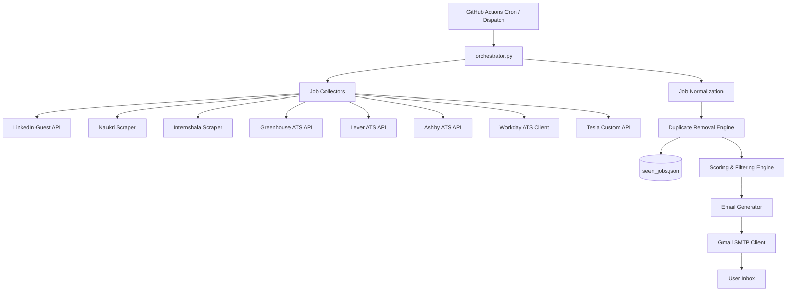

# 🚀 Career Radar AI – Bangalore Startup Job Discovery System

Career Radar AI is a complete, production-ready, fully automated job discovery system designed to run autonomously on GitHub Actions. It continuously monitors and indexes internship, graduate, startup, and entry-level positions, prioritizing Bangalore-based onsite/hybrid roles and Remote India placements.

---

## 📊 System Architecture

The following diagram illustrates the workflow and modular structure of the Career Radar AI system:



---

## ✨ Features

- **Automated Collection**: Queries LinkedIn Guest APIs, Naukri, Internshala, and ATS APIs (Greenhouse, Lever, Ashby, Workday) to bypass anti-bot scrapers cleanly.
- **Geographic Filtering**: Enforces a strict local constraint, prioritizing Bangalore/Bengaluru onsite and Hybrid roles, Remote India opportunities, and global remote roles. Other onsite locations (like Mumbai, Hyderabad, Pune, Delhi, etc.) are filtered out.
- **Scoring & Ranking**: Implements custom keyword weights (Product & Founder's Office = 100, Robotics & Physical AI = 95, Software Engineering = 90, AI/ML = 80) to classify listings into Tiers A, B, and C.
- **Strict Duplicate Exclusions**: Validates discovered opportunities against a local state (`data/seen_jobs.json`). Older entries are pruned automatically to prevent performance bloat.
- **Flexible Filters**: Automatically ignores negative terms (Teacher, STEM Trainer, Sales, Call Center, BPO, Telecaller, etc.) and enforces experience limitations (0-2 years, Internships, Graduate Programs, Trainees).
- **Daily Alerts**: Dispatches a categorized report to your inbox three times a day.
- **Weekly Analytics**: Generates a summary report every Sunday showing top hiring startups, popular skill tags, remote opportunities, and PM/Robotics metrics.
- **100% Free**: Operates entirely within GitHub Actions and standard SMTP.

---

## ⚙️ Environment Configuration

Create a `.env` file in the root directory (based on `.env.example`):

```bash
# SMTP configuration
SMTP_SERVER=smtp.gmail.com
SMTP_PORT=587
SMTP_USERNAME=shashwatsahu.contact@gmail.com
SMTP_PASSWORD=your_gmail_app_password

# Destination Configuration
DESTINATION_EMAIL=shashwatsahu.contact@gmail.com
```

### How to Create a Gmail App Password
1. Visit your [Google Account Settings](https://myaccount.google.com/).
2. Navigate to **Security**.
3. Under "How you sign in to Google", select **2-Step Verification** and turn it ON if it isn't already.
4. Scroll to the bottom of the 2-Step Verification page and click **App passwords**.
5. Select **Mail** and **Other (Custom name)**, type `Career Radar`, and click **Generate**.
6. Copy the 16-character code and paste it as the `SMTP_PASSWORD` in your `.env` or GitHub Secrets.

---

## 🚀 GitHub Actions Setup

To deploy this project to run autonomously:

1. Push this repository to your GitHub account.
2. In the repository settings, go to **Settings > Secrets and Variables > Actions**.
3. Create the following Repository Secrets:
   - `SMTP_USERNAME` = `shashwatsahu.contact@gmail.com`
   - `SMTP_PASSWORD` = `your_16_character_app_password`
   - `DESTINATION_EMAIL` = `shashwatsahu.contact@gmail.com`
4. Go to **Settings > Actions > General > Workflow permissions** and select **Read and write permissions** (this allows the action to commit and update `data/seen_jobs.json` dynamically).

The workflow will run automatically at:
- **06:00 AM IST** (00:30 UTC)
- **02:00 PM IST** (08:30 UTC)
- **08:00 PM IST** (14:30 UTC)
- **08:00 AM IST Sunday** (02:30 UTC) (Weekly Report)

---

## 🛠️ Local Development & Execution

Install dependencies:
```bash
pip install -r requirements.txt
```

Run a manual jobs check:
```bash
python -m src.engine
```

Run unit tests:
```bash
python -m unittest discover -s tests
```
