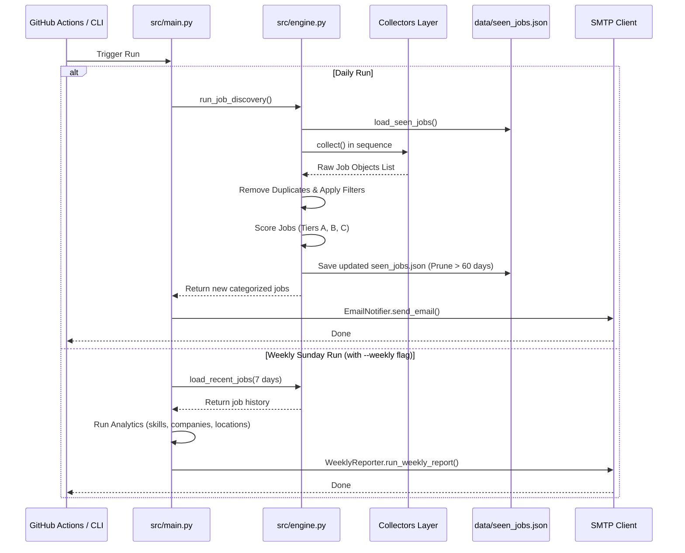

# Career Radar AI - System Architecture Documentation

This document describes the design, code organization, and execution flow of the **Career Radar AI** Job Search Automation system.

---

## 🛠️ Code Directory Layout

```
Carrer Radar-AI Job Search Automation/
├── .github/
│   └── workflows/
│       └── career_radar.yml       # GitHub Actions orchestration workflow
├── data/
│   └── seen_jobs.json             # Flat JSON database storing sent jobs history
├── docs/
│   └── architecture.md            # Architecture documentation (this file)
├── src/
│   ├── __init__.py
│   ├── config.py                  # Environment settings, keywords list, rules
│   ├── engine.py                  # Core logic (scoring, seen db management)
│   ├── main.py                    # Entrypoint runner script
│   ├── models.py                  # Job dataclass schemas
│   ├── notifier.py                # Email HTML styling and Gmail SMTP TLS dispatcher
│   ├── weekly_reporter.py         # Sunday weekly analytics analyzer and reporter
│   └── collectors/
│       ├── __init__.py
│       ├── base.py                # Base collector abstraction (HTTP retries, session headers)
│       ├── greenhouse.py          # Greenhouse ATS API
│       ├── lever.py               # Lever ATS API
│       ├── ashby.py               # Ashby ATS API
│       ├── workday.py             # Workday search client
│       ├── tesla.py               # Tesla CUA jobs endpoint
│       ├── linkedin.py            # LinkedIn Guest search API
│       ├── naukri.py              # Naukri search API with appid/systemid headers
│       └── internshala.py         # Internshala HTML BeautifulSoup scraper
└── tests/
    ├── __init__.py
    └── test_engine.py             # Core test suite
```

---

## 🔄 Core Data & Execution Flow



---

## ⚡ Key System Components

### 1. Robust Collectors Layer (`src/collectors/`)
To bypass aggressive anti-bot protections (like Cloudflare and Akamai) without paying for premium proxy rotating services, the system targets structured APIs and public guest search endpoints:
- **Greenhouse, Lever, and Ashby**: Query official public JSON endpoints directly.
- **Workday**: Makes `POST` requests to public search directories for specific firms (e.g., Boston Dynamics).
- **Tesla**: Intercepts the internal endpoint used by Tesla's browser site (`/cua-api/apps/careers/state`).
- **LinkedIn**: Targets the public guest search API (`seeMoreJobPostings`) using a composite `OR` keyword query. This reduces total requests from dozens down to 1-2 per location, avoiding rate limits.
- **Naukri**: Formulates requests with desktop headers (`appid: 109`, `systemid: Naukri`) and fails gracefully if token validation rejects them.
- **Internshala**: Parses standard search lists with BeautifulSoup.

### 2. Job Normalization & Exclusions (`src/engine.py`)
All crawled postings are transformed into a standardized `Job` dataclass.
- **Duplicate Prevention**: Excludes jobs with matching IDs or apply URLs present in `data/seen_jobs.json`.
- **Negative Filters**: Discards jobs whose titles contain telecalling, generic sales, STEM trainers, teachers, or customer service terms.
- **Experience Filtering**: Restricts results to entry-level/intern postings. It rejects titles containing senior indicators (Senior, Lead, Manager, Principal, Sr, etc.) and parses descriptions to filter out roles requiring 3+ years of experience.

### 3. Keyword Scoring Engine (`src/engine.py`)
Matches lowercase words in titles (and falls back to descriptions) against weighted keywords to calculate a score:
- **100**: Physical AI, Embodied AI, Robotics
- **95**: ROS2, Computer Vision, SLAM, Perception, Autonomous Systems, Motion Planning
- **90**: Software Engineering, Python
- **85**: AI Engineering, Machine Learning
- **70-75**: Solutions Engineer, APM, Founder's Office
- **Score < 50**: Discarded.
- **Tiers**: Categorizes matches into **Tier A** (Score > 80), **Tier B** (65-80), and **Tier C** (50-65).

### 4. Resilient Error Handling & Retry Logic (`src/collectors/base.py`)
- Extends all requests with custom retry wrappers.
- Implements exponential backoff (e.g., waiting 1.5s, 2.25s, etc.) when hit with rate limits (429) or gateway timeouts (504).
- Isolates collector execution: if a specific website is down or blocking, it prints a stack trace to log outputs, ignores the collector, and continues processing data from all other active platforms.
- Database cleanups run on every execution to prune seen items older than 60 days, keeping repository file sizes minimal.
